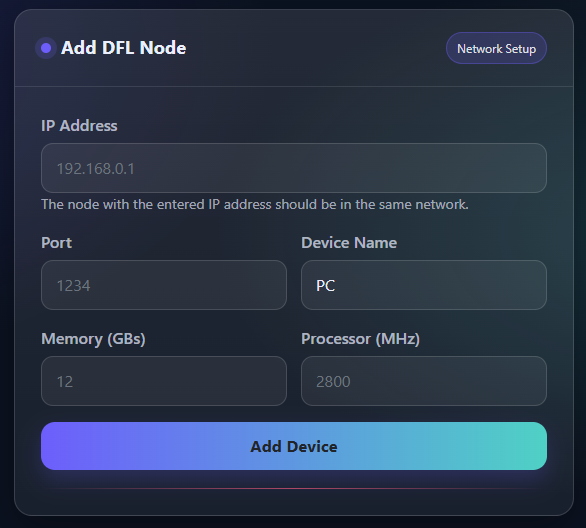

# Register new device through digital twin interface

In digital twin interface, click to "Add Device" option. Then fill the device information including: IP Address, Port, Device Name, Memory and Processor (MHz)

After that, click to "Add Device" button to add new device to the database